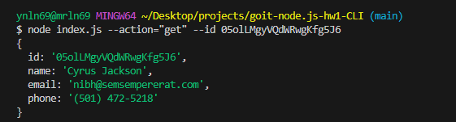
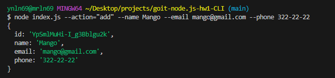
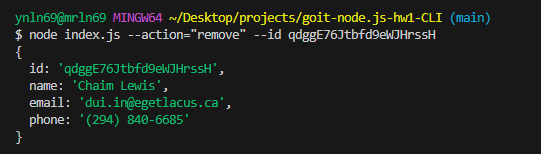

## Отримуємо і виводимо весь список контактів у вигляді таблиці (console.table)

## Отримуємо контакт по id і виводимо у консоль об'єкт контакту або null, якщо контакту з таким id не існує.

## Додаємо контакт та виводимо в консоль об'єкт новоствореного контакту

## Видаляємо контакт та виводимо в консоль об'єкт видаленого контакту або null, якщо контакту з таким id не існує.

